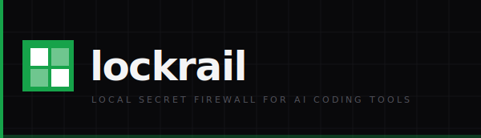
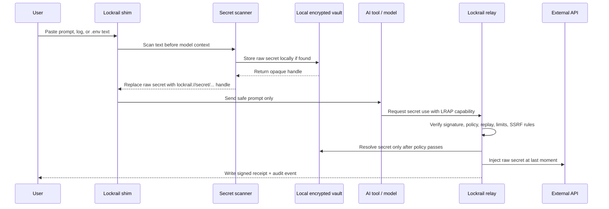

<p align="center">
  
</p>

<p align="center">
  <a href="https://github.com/lockrail/lockrail/actions/workflows/ci.yml"></a>
  <a href="https://github.com/lockrail/lockrail/actions/workflows/security.yml"></a>
  <a href="https://crates.io/crates/lockrail"></a>
  <a href="https://img.shields.io/crates/d/lockrail"></a>
  
  
</p>

<p align="center">
  <b>AI tools read everything you type. Lockrail stops your secrets from reaching them.</b>
</p>

---

Lockrail sits between you and your AI coding tool. Secrets are intercepted before they enter the model's context window, encrypted locally with AES-256-GCM, and replaced with opaque handles. When the agent needs to make an API call, a time-bound signed token is checked against relay policy — the raw secret is injected at the last moment and never stored in any model context.

No cloud. No account. Single binary.

---

## Features

- **Two interception modes** — PTY shim (wraps any CLI tool) or conservative HTTPS proxy (`lockrail proxy`, port 8789)
- **30+ detection patterns** — OpenAI, Anthropic, AWS, GCP, GitHub, npm, PyPI, HuggingFace, JWT, private keys, high-entropy strings
- **Opaque handle round-trip** — `lockrail://secret/<name>/<fp>` replaces plaintext; model cannot reconstruct the original
- **Local encrypted vault** — AES-256-GCM + Argon2id KDF (19,456 KiB, 2 iterations), file perms 0600, atomic writes with fsync
- **LRAP capability tokens** — Ed25519-signed, time-bound, max-use enforced, replayed tokens rejected
- **SSRF + DNS rebinding protection** — relay blocks localhost, link-local, metadata endpoints, and rebinding attempts
- **Hash-chained audit log** — SHA-256 chained events with signed receipts; `lockrail audit verify` detects any tampering
- **Claude Code hooks** — UserPromptSubmit and PostToolUse hooks block secrets entering and leaving the model
- **Works offline** — vault, relay, and proxy all run locally; no Lockrail cloud required
- **Supports** Claude Code · Codex · Cursor · Antigravity · any MCP server

## Install

Fast path: one command downloads Lockrail and auto-configures this machine. No Rust
toolchain, no Cargo dependency stream, no password prompt, no account.

```bash
curl -fsSL https://raw.githubusercontent.com/lockrail/lockrail/main/install.sh | sh
```

Windows PowerShell:

```powershell
irm https://raw.githubusercontent.com/lockrail/lockrail/main/install.ps1 | iex
```

Source build fallback:

```bash
cargo install lockrail
lockrail setup
```

Or download a prebuilt binary manually from [Releases](https://github.com/lockrail/lockrail/releases).

**Supported:** macOS (ARM, Intel) · Linux (x86\_64, ARM64) · Windows (x86\_64)

**Not supported yet:** Homebrew. Do not use `brew tap lockrail/tap`; that tap does not exist.

## Quickstart

```bash
lockrail demo    # see interception in action after the installer finishes
```

The installer runs `lockrail setup` for you. That setup command generates a random
local vault key, creates the encrypted vault, generates local agent identity, and
installs shims for Claude, Codex, Cursor, and Antigravity. The generated key stays
on your machine at `~/.lockrail/vault.key` with private file permissions.

Or use the HTTPS proxy instead of PTY shims:

```bash
lockrail proxy install-ca           # generate local CA + install in system trust store
lockrail proxy start                # start HTTPS intercepting proxy on :8789
```

## End-to-end flow

After install, the normal user flow is:

```bash
# 1. Install. The installer also runs setup.
curl -fsSL https://raw.githubusercontent.com/lockrail/lockrail/main/install.sh | sh

# 2. Use your AI tool normally.
claude

# 3. Paste text, logs, or a .env snippet that contains a secret.
OPENAI_API_KEY=sk-proj-demo-abcdefghijklmnopqrstuvwxyz123456
```

Lockrail sits in front of the AI tool through a local shim. The user keeps using
`claude`, `codex`, `cursor`, or `agy`; the shim is what receives the terminal
input first.



Concrete example:

```text
User input:
  OPENAI_API_KEY=sk-proj-demo-abcdefghijklmnopqrstuvwxyz123456

What the AI tool receives:
  OPENAI_API_KEY=lockrail://secret/openai-key/fp_7c2f...

What stays local:
  Raw secret encrypted inside ~/.lockrail/vault.lockrail
  Vault key stored at ~/.lockrail/vault.key with private permissions
  Tamper-evident audit event in ~/.lockrail/audit.log
```

What happens internally:

| Step | What Lockrail does | Security control |
|---|---|---|
| Install | Downloads the release binary, verifies SHA-256 when available, then runs setup | No Rust toolchain or Cargo dependency stream for normal users |
| Setup | Generates a random local vault key and local agent identity | `~/.lockrail/vault.key`, private file permissions |
| Intercept | Shim receives terminal input before the AI tool | Model does not get first look at pasted text |
| Detect | Scans for 30+ provider formats, private keys, JWTs, and high-entropy strings | Pattern matching + Shannon entropy checks |
| Seal | Stores the raw secret locally and replaces it with an opaque handle | AES-256-GCM vault encryption, Argon2id key derivation |
| Use | Agent must request use through the local relay | Ed25519-signed LRAP capability token |
| Enforce | Relay checks host, path, replay, max-use, and private-network rules | SSRF + DNS rebinding protection, replay store, usage cap |
| Audit | Writes a receipt for the use event | SHA-256 hash-chained audit log |

The important boundary: the model sees the handle, not the raw secret. The raw
secret is only resolved later, locally, after policy checks pass.

## Commands

<details>
<summary><b>Setup</b></summary>

| Command | Description |
|---|---|
| `lockrail setup` | Auto-configure this machine: local vault key, encrypted vault, agent keys, shims |
| `lockrail ai hooks` | Install Claude Code UserPromptSubmit + PostToolUse hooks |
| `lockrail ai enable` | Install Lockrail skill file into Claude/Codex/Cursor config |
| `lockrail status` | Vault state, installed tools, recent activity |
| `lockrail doctor` | Diagnose common configuration problems |
| `lockrail ui` | Open local dashboard (localhost, token-protected) |

</details>

<details>
<summary><b>Secrets</b></summary>

| Command | Description |
|---|---|
| `lockrail secret set <NAME>` | Store a secret (value prompted, never echoed) |
| `lockrail secret list` | List stored secrets (metadata only — no plaintext) |
| `lockrail secret delete <NAME>` | Remove a secret from the vault |
| `lockrail secret import <FILE>` | Bulk import from a `.env` file |
| `lockrail secret export --format dotenv` | Export to plaintext `.env` — handle with care |
| `lockrail seal` | Read stdin, seal any secrets found, print safe output |
| `lockrail scan` | Read stdin, report findings only — nothing is stored |
| `lockrail pipe` | Filter piped output before pasting into an AI tool |

</details>

<details>
<summary><b>Relay</b></summary>

| Command | Description |
|---|---|
| `lockrail relay start` | Start local HTTP relay |
| `lockrail relay check` | Ping relay healthz endpoint; exits 1 if unreachable |
| `lockrail capability issue <NAME>` | Issue a time-bound capability token for a secret |
| `lockrail capability inspect <TOKEN>` | Decode and display token claims |
| `lockrail use-key <NAME>` | Resolve a handle to a secret (records last-used timestamp) |

</details>

<details>
<summary><b>HTTPS Proxy</b></summary>

| Command | Description |
|---|---|
| `lockrail proxy install-ca` | Generate local CA cert + install in system trust store |
| `lockrail proxy start` | Start HTTPS intercepting proxy on port 8789 |
| `lockrail proxy status` | Check if proxy is running and CA is trusted |

</details>

<details>
<summary><b>Audit</b></summary>

| Command | Description |
|---|---|
| `lockrail audit list` | Show recent audit events |
| `lockrail audit verify` | Verify the SHA-256 hash chain — detect any tampering |
| `lockrail proof pack` | Export a signed compliance bundle (zip + manifest) |

</details>

<details>
<summary><b>Sync</b></summary>

| Command | Description |
|---|---|
| `lockrail sync github` | Push secrets to GitHub Actions (X25519 sealed-box) |
| `lockrail sync vercel` | Sync secrets to Vercel environment variables |

</details>

## Protection surface

| Surface | What Lockrail does |
|---|---|
| Terminal stdin | Scanned and sealed before the AI tool sees it |
| `.env` files | Handle-based sealing — safe for agent inspection |
| Tool output / responses | PostToolUse hook scans before the model incorporates it |
| Supported AI API HTTPS hosts (proxy mode) | Scans uncompressed textual/JSON request and response bodies; streams, compressed bodies, and unknown binary content pass through unchanged |
| Relay calls | LRAP token check · SSRF block · replay detection · usage cap |
| Audit log | SHA-256 hash chain · signed receipts · tamper detection |

**Not covered:** GUI flows outside the proxy, clipboard capture, keyloggers, compressed or streaming proxy bodies that cannot be safely rewritten, unsupported AI API hosts, or a fully compromised host while the vault is unlocked.

## Comparison

| | Lockrail | ggshield ai-hook | Infisical Agent Vault | Doppler / Phase |
|---|:---:|:---:|:---:|:---:|
| Intercepts AI prompt context | ✓ | 4 tools | — | — |
| HTTPS proxy for supported AI hosts | ✓ | — | — | — |
| Opaque handle round-trip | ✓ | — | — | — |
| Local vault, no server required | ✓ | — | — | — |
| No account or cloud dependency | ✓ | — | — | — |
| SSRF + DNS rebinding protection | ✓ | — | partial | — |
| Signed audit receipts | ✓ | — | — | — |
| Post-response secret scanning | ✓ | notify only | — | — |
| Open source, MIT / Apache-2.0 | ✓ | ✓ | ✓ | ✓ |

## Cryptography

- **Vault:** AES-256-GCM, fresh 96-bit nonce and 128-bit salt per save
- **KDF:** Argon2id — 19,456 KiB memory, 2 iterations, 1 lane (OWASP recommended)
- **Capability tokens:** Ed25519 (ed25519-dalek), time-bound, max-use enforced, replay-rejected
- **Audit chain:** SHA-256 event hashing, each event includes the hash of the previous
- **Sync encryption:** X25519 sealed-box for GitHub Actions secret push
- **Proxy TLS:** rcgen-generated local CA; rustls with ring backend

All cryptographic material stays on disk at `~/.lockrail/` with 0600 permissions. No keys leave the machine.

## Building from source

```bash
git clone https://github.com/lockrail/lockrail
cd lockrail
cargo build --release
./target/release/lockrail --version
```

Requires Rust 1.96+. Run `rustup update stable` if needed.

## Contributing

Bug reports, feature requests, and pull requests are welcome. See [CONTRIBUTING.md](CONTRIBUTING.md) for guidelines and [SECURITY.md](SECURITY.md) for responsible disclosure.

## Author

[Het Mehta](https://hetmehta.com) — [hi@hetmehta.com](mailto:hi@hetmehta.com) — [@hetmehtaa](https://x.com/hetmehtaa)

## License

MIT OR Apache-2.0
